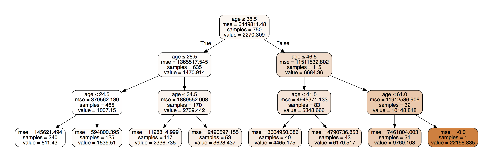

# The Model
The Model class uses a [decision tree regressor](http://scikit-learn.org/stable/modules/tree.html#regression) of scikit learn to
estimate the mean and the variance of a column for the
rows of the data matching the given where-clause. The
column the mean and variance are calculated from
is called the output and the columns the where-clause
uses to narrow down the rows are called features.
The output must be continuous. Features can be
continuous, categorical or boolean.

An
example of a decision tree is shown below. The depth of
the tree was limited to 4 to keep the image at a
reasonable size.

The parameters of the tree are the defaults of scikit
learn, except the random state of the tree is fixed,
and the depth of the tree can be limited.

The Model class splits the given data to a training
and a test set. The training set is used to train
the decision tree model and the test set is used
to evaluate the performance of the tree. The split
is done with [train_test_split](http://scikit-learn.org/stable/modules/generated/sklearn.model_selection.train_test_split.html) with default parameters,
except the random state is fixed.

When using a large dataset, Model supports the objects
that pandas returns from read_* methods with [chunksize](https://pandas.pydata.org/pandas-docs/stable/io.html#io-chunking)
set. For each chunk the object yields when iterated,
one decision tree is created. Queries are made on all
trees, and their results are averaged for the final
result.

# Queries
The where-clause can contain an arbitrary expression of
conditions combined with "and" and "or" operators.
Each condition is of the form "*feature* > *value*",
where
*feature* is one of the features of the model and
*value* is an arbitrary real number. The lesser than and
equality comparisons are also supported. If *feature*
is categorical or a boolean, only equality is supported.

The query is made by traversing the tree for each
condition and combining the results.

## Traversing the tree

The tree is traversed for each condition by starting
from the root and doing the following for each
encountered node. Below *value* is the constant of the
condition and *threshold* is the threshold of a
decision tree node that is being processed.
While traversing, the minimum and the maximum values
that the condition's feature can have in a node
is being kept track of by the variables *min* and
*max*. They are initialized to the minimum and maximum
value of the feature in the entire dataset. When
proceeding to a left, child, *max* is updated to
*threshold* and when proceeding to a right child,
*min* is updated to *threshold*, except as noted
below.
* If the feature of a node not the same as the feature
of the condition, proceed to both of the nodes
children and don't update *min* and *max*.
* If the feature of the node is the same as the
feature of the condition, proceed to one or both of
the children as follows:
  * If the condition is an equality, proceed to the
  left child, if *value* <= *threshold*, otherwise
  proceed to the right child.
  * If the condition is a lesser than, proceed to the
  left child, if *value* <= *threshold*, otherwise
  proceed to both children.
  * If the condition is a greater than, proceed to the
  right child, if *value* >= *threshold*, otherwise
  proceed to both children.
* If the node is a leaf, return a dictionary with one
(*key*, *nrr*) pair, *key* being the index of the
node and *nrr* being a NodeResultRange for the
condition and *min* and *max*.

NodeResultRange objects contain the *min* and *max*
values calculated earlier, the feature they represent
and the subset of the interval (*min*, *max*) that
matches the condition. They also have a match_fraction
method that calculates the fraction of samples that
match the condition in their node.

The dictionaries returned by all encountered leaf nodes
are combined into one result for the condition. As
each leaf is only encountered once, the dictionaries
for all leaves cannot have duplicate keys.

## Combining the results

Once the tree has been traversed for all of the
conditions, the expression tree that the & and |
operators form is evaluated. The values of the nodes
of the expression tree are dictionaries containing
NodeResultRange and
NodeResult objects indexed by the node indexes of the
decision tree. NodeResultRange objects come from the
leaf nodes, who's dictionaries come from the decision
tree traversal made earlier. NodeResult
objects are created during later.

NodeResult objects contain a match_fraction field
that represents the fraction of samples in the node
that match the part of the query that they represent.

Starting from the parents
of leaf nodes, the children of a node are combined
with the operator of the node.

For &-nodes, the
combined dictionary contains the intersection of keys
of the child dictionaries. For each key in the
resulting intersection, the NodeResult or
NodeResultRange objects in the child dictionaries for
that key are combined. When both of the children
contain NodeResultRanges that are of the same feature,
the match_intervals of both NodeResultRanges are
intersected and the resulting dictionary will get
a NodeResultRange with the intersection as it's
match_interval. Otherwise, a NodeResult object is
created, and it's match_fraction is set to the product
of the match_fractions of the children.

For |-nodes, the combined dictionary will contain
the union of keys of the child dictionaries. If only
one child has a particular key, that key gets the
child dictionary's object in the result. If both have
a particular key, the objects the children contain
in that key are combined. As before, two
NodeResultRange objects with the same feature combine
to another NodeResultRange, but this time the
new match_interval is the union of the children's
object's match_intervals. Otherwise, a NodeResult
object is created, but this time the match_fraction
has a more complicated form. Let *m1* and *m2* be
the match_fractions of the children. The combined
match_fraction is 1 - (1 - *m1*)(1 - *m2*).

After the root node of the expression tree has been
evaluated, we have a dictionary of all decision tree
nodes that
match the query, and weights for each node estimating
how many of it's node actually match the query.
When calculating the overall mean and variance for the
query, we assume that the mean and variance for the
rows matching the query in each node are the same
as the overall mean and variance of that node. Then
we can calculate the mean and variance for all of the
rows that were found to match the query.
